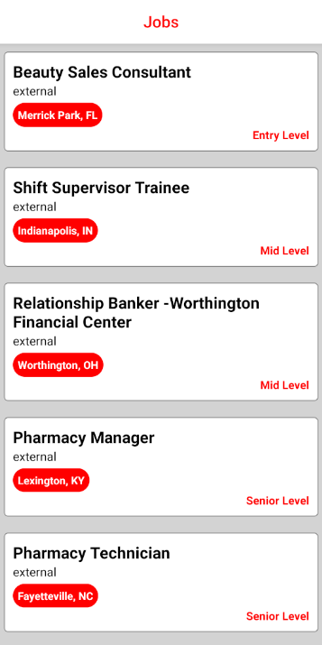
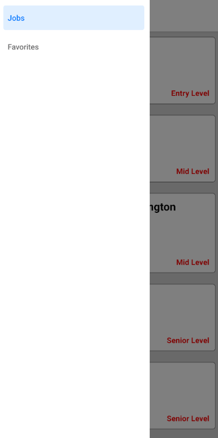
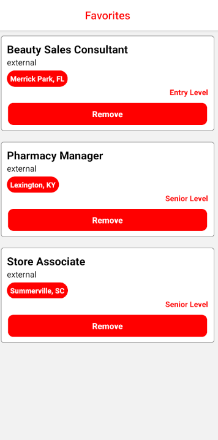

# Kodwork

Kodwork, yazılımcılar için iş ilanlarını listeleyen ve favorilere ekleme özellikleri sunan bir React Native uygulamasıdır. Bu uygulama, iş arayanların ihtiyaç duyduğu iş ilanlarına kolayca erişmelerini sağlar ve beğendikleri ilanları favorilere ekleyerek takip etmelerini sağlar.

## Özellikler

- **İş İlanları Sayfası**: 
  - Mevcut iş ilanlarının listelendiği ana sayfa.
  - Kullanıcılar, iş ilanlarını burada görebilir ve detaylarına erişebilir.
  -  

- **İş İlanı Detay Sayfası**:
  - Her bir iş ilanının detaylarını gösteren sayfa.
  - İş ilanının tüm bilgilerini (örneğin, şirket adı, pozisyon, lokasyon, iş tanımı) burada bulabilirsiniz.
  -  

- **Favorilere Ekleme**:
  - İş ilanlarını favorilere ekleyebilir ve daha sonra kolayca erişebilirsiniz.
  - Favorilere eklenen ilanlar, favoriler sayfasında listelenir.
  -  

- **Favoriler Sayfası**:
  - Favorilerinize eklediğiniz iş ilanlarının listelendiği sayfa.
  - Bu sayfa, favori ilanlarınıza hızlıca erişmenizi sağlar.
  -  

## Kurulum

1. Projeyi klonlayın:
   
  ```
  git clone https://github.com/Dogukan-Hellac/kodwork.git
  ```
   
2. Proje dizinine gidin:

  ```
  cd kodwork
  ```
3. Uygulamayı çalıştırın:

  ```
  npx expo start
  ```


